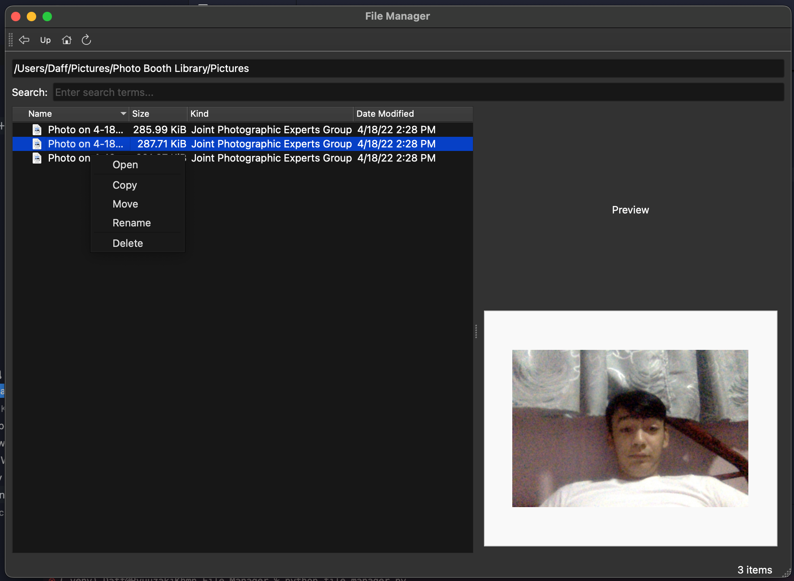

# PySide6 File Manager

A basic file manager application built with PySide6 (Qt for Python). It provides a graphical interface for browsing, managing, and previewing files on your system.



## Features

- Browse files and directories using a tree view
- Search for files by name or extension
- Perform basic file operations: copy, move, delete, and rename
- Right-click context menu for quick actions
- Preview images and display basic info for other file types
- Drag-and-drop support for moving files
- Cross-platform support (Windows, macOS, Linux)

## Requirements

- Python 3.7 or higher
- PySide6

## Installation

### From Source

Install PySide6 using pip:

```bash
pip install pyside6
```

Run the application:

```bash
python file_manager.py
```

### Pre-built Installers

Download the appropriate installer for your platform from the [releases page](https://github.com/KCprsnlcc/File-Manager/releases):

- Windows: `FileManager-Setup.exe`
- macOS: `FileManager.dmg`
- Linux: `filemanager_1.0.0_amd64.deb`

## Building Installers

To build installers for distribution, see [BUILD.md](BUILD.md) for detailed instructions.

**Important Note:** Each platform installer must be built on the respective operating system:
- Windows installers must be built on Windows
- macOS installers must be built on macOS
- Linux installers must be built on Linux

The quickest way to build an installer for your current platform:

```bash
# Install dependencies
pip install -r requirements.txt

# Build for your current platform
python build_all.py
```

## Release Notes
Check the [Release Notes](RELEASE_NOTES.md)! there are Important Notice about this Release.
- ✅ **macOS (.dmg)**: Ready for use - built on macOS
- ⚠️ **Windows (.exe)**: Placeholder only - must be built on Windows
- ⚠️ **Linux (.deb)**: Placeholder only - must be built on Linux

## Contributing

Contributions are welcome! Please open issues or submit pull requests for improvements and bug fixes.

## License

This project is licensed under the [License](License.md).